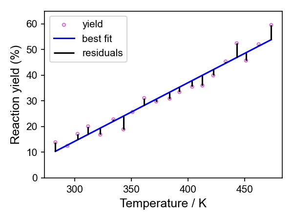

# Least squares optimisation

Least squares optimisation is used extensively in chemistry and other fields to find best-fit solutions for modelling datasets.

Given a function to model observed data, least squares methods find the best-fit solution by adjusting the model’s parameters to minimise its error. This is done by reducing the total sum of the squared differences (the residuals) between the model’s predictions and the data.

To get an idea of what is actually going on, we can look a simple case of fitting a straight line through a set of points $n$ defined by their $x$ and $y$ values $(x_n, y_n)$. These could represent set of experimental observations like the yield of a reaction as a function of reaction temperature.

## 1. Fitting a Line Through Two Points as a System of Equations
Let's say we observe two data points $(x_1, y_1)$ and $(x_2, y_2)$.  

We will assume the data follows a straight-line model:

$$
y = mx + c
$$

For the two points, this gives two equations:

$$
m x_1 + c = y_1
$$

$$
m x_2 + c = y_2
$$

This is simply a **system of two linear equations** with two unknowns ($m$ and $c$), which we can solve exactly: We use standard algebra to solve the simultaneous equations to find $m$ and $c$.

## 2. Fitting a Line Through Two Points in Matrix Form

We can rewrite the same system in matrix notation:

$$
\begin{bmatrix} x_1 & 1 \\ x_2 & 1 \end{bmatrix}  
\begin{bmatrix} m \\ c \end{bmatrix}  
=  \begin{bmatrix} y_1 \\ y_2 \end{bmatrix}
$$

or more generally:

$$
A x = b
$$

where:

$$
A = \begin{bmatrix} x_1 & 1 \\ x_2 & 1 \end{bmatrix}, \quad
x = \begin{bmatrix} m \\ c \end{bmatrix}, \quad
b = \begin{bmatrix} y_1 \\ y_2 \end{bmatrix}
$$

Since we have **exactly two equations for two unknowns**, we can solve this directly using algebra (e.g. by inverting the matrix $A$ assuming it is non-singular).  

## 3. What If There Are More Than Two Points?

Now, suppose we have **more than two** data points $(x_1, y_1), (x_2, y_2), \dots, (x_n, y_n)$.

We still use the same setup for the matrices:

$$
\begin{bmatrix} x_1 & 1 \\ x_2 & 1 \\ \vdots & \vdots \\ x_n & 1 \end{bmatrix}  
\begin{bmatrix} m \\ c \end{bmatrix}  
=  \begin{bmatrix} y_1 \\ y_2 \\ \vdots \\ y_n \end{bmatrix}
$$

But now there are **more equations than unknowns** (this is known as an **overdetermined system**). It means that there is **no exact solution**. 

Imagine you have done this reaction at 20 different temperatures and worked out the yield for each one. You are trying to find the line of best fit through those points. There will always be some distance between at least some of those points and whatever line you have drawn, even if the straight line model is the best representation of the relationship.

Instead of finding an exact solution, we look for the **best approximate solution** by minimising the error between the predicted values and the observed data.  

So instead solving $Ax = b$ exactly, **least squares methods** do this by trying to solve 

$$
A^T A x = A^T b
$$

This equation gives the values of $x$ (containing the parameters of our model, $m$ and $c$) that minimise the error, as quantified by the sum of squared residuals (SSR) (the difference between the model and the observed data).

#### Direct methods

For some problems, it is possible to solve this equation directly. 

If $A^T A$ is invertible and it is computationally feasible, you can solve for $x$ directly [using algebra](https://statisticsbyjim.com/regression/least-squares-regression-line/), which is the approach used by [**Ordinary Least Squares**](https://www.analyticsvidhya.com/blog/2023/01/a-comprehensive-guide-to-ols-regression-part-1/) (OLS). This would give us the **best-fit values for $m$ and $c$**. 

Other **direct methods** for solving least squares problems include [**Singular Value Decomposition**](https://gregorygundersen.com/blog/2018/12/10/svd/) (SVD), which can improve stability when $A^T A$ is ill conditioned. SVD also has advantages when working with noisy data, offers greater computationally efficiency and can enhance the interpretability of the results.

## 4. Iterative Methods for Least Squares Optimisation

For some minimisation problems, computing the inverse of $A^T A$, i.e. $(A^T A)^{-1}$, can be computationally expensive (e.g. for very large datasets) or $A^T A$ is ill-conditioned (close to singular, making it unstable to inversion). In these cases, an **iterative approach** can be used instead.

Iterative methods - as the name suggests - adjust the value of $x$ step-by-step gradually minimising the sum of squared residuals until a minimum is located. 

**Steepest Descent** adjusts $x$ using the gradient of the squared error. The algorithm moves in the direction largest downward - most negative - gradient to minimise the error. While effective, it can be inefficient due to slow convergence compared to other iterative methods. ("Steepest descent" and "gradient descent" are often used interchangably in some areas. Strictly, they are different as steepest descent is a special case of gradient descent. I'd suggest asking a mathematician, or ChatGPT failing that.)

[**Levenberg-Marquardt**](https://www.statisticshowto.com/levenberg-marquardt-algorithm/) is a more advanced technique that dynamically adjusts the step size depending on how close it is to a solution. This means it offers **faster convergence** than Steepest Descent. It is commonly used for nonlinear curve fitting and is the default method for least squares fitting in `scipy.optimize.curve_fit` due to its fast and stable performance.

### **Key points**
- **Fitting a line through two points** is just solving two simultaneous equations.  
- **Fitting a line through many points** leads to an **overdetermined system**, where we use **least squares** to find the best fit.
- Least squares methods find an **approximate solution** that minimises the error between the predictions and the observed data.
- **Direct methods** such as **OLS** and **SVD** solve a set of equations that mathematically express the least squares condition, providing the best-fit parameters in a single calculation.
- **Iterative methods** offer an alternative approach by making step-by-step adjustments to the solution until the error is minimised.

  