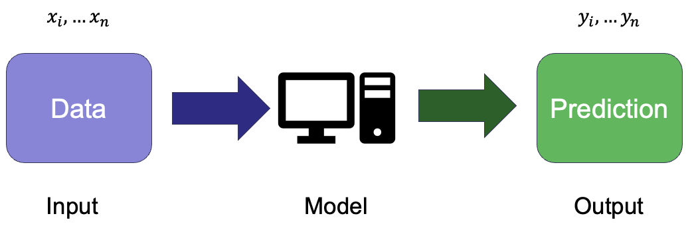

# Introduction to Machine Learning

## What is machine learning?

Machine learning
: A subset of AI that involves the development of computer algorithms that enable computers to learn from data without being explicitly programmed.

The basic aim is to develop a model that maps an input (which is the data) to an output (the variable or target to be predicted).

In many cases, the model is a mathematical function - or a collection of functions - and to obtain a model that works effectively to map the input to the output.

### Some examples

- Given a dog's breed, height and age, predict their weight.
- Given a compound's SMILES, molecular weight and total polar surface area, predict its boiling point.

 

- From a customer's balance, income and employment status, predict whether they will become overdrawn in the next month.
- Based on an ionic compound's formula, the charge and radii of its ions, predict if it will form a rock salt structure.

## Types of machine learning

### Supervised learning

- Trains a model on a labelled dataset.
- Each input (set of features) is associated with a known output (target variable).
- Aims to learn a function that maps inputs to outputs so that the model can make accurate predictions on unseen data.
- Training minimises a loss function, which measures how far the model's predictions are from true values.
- Widely used for both 
  - **regression** tasks (predicting continuous values). 
  - **classification** tasks (assigning categories).
- Useful when clear relationships exist between inputs and outputs

### Unsupervised learning

- Involves learning from unlabelled data.
- Aims to identify patterns or structures in the data without predefined categories or values.
- Most common applications are 
  - **clustering** (grouping similar data points)
  - **dimensionality reduction** (simplifying data while retaining significant information)
- Because known "true" values are not available, there is no explicit error to guide the model training.
  - Learning maximises similarity within clusters (clustering) or preserving variance in the data (dimensionality reduction).
- Useful for exploratory analysis when relationships in the data are unknown.

### Reinforcement learning

- Involves an agent interacts with an environment to achieve a goal.
- The agent takes actions and receives feedback in the form of rewards or penalties.
- Reinforcent learning learns through trial and error, improving its strategy over time.
- The algorithm aims to maximise the cumulative reward; this may require balancing short-term and long-term gains.
- It is applied in fields such as robotics, game playing (e.g. AlphaGo) and self-driving cars.
- Useful when an explicit mapping from inputs to outputs is not available, but optimal decision-making is needed.

 

|              | **Supervised Learning** | **Unsupervised Learning** | **Reinforcement Learning** |
|--------------------------|------------------------|--------------------------|----------------------------|
| **Data type**           | Labelled (input-output pairs) | Unlabelled (no predefined outputs) | No predefined labels, learns from rewards |
| **Goal**               | Learn a function to map inputs to known outputs | Discover hidden patterns or structures | Learn best actions to maximise cumulative rewards |
| **Examples tasks**  | Regression, classification | Clustering, dimensionality reduction | Decision-making, control problems |
| **Training process**   | Minimises a loss function based on known outputs | Finds structure without explicit output labels | Learns via trial and error with rewards/penalties |
| **Common algorithms** | Linear regression, decision trees, neural networks | k-means clustering, PCA, DBSCAN | Q-learning, deep Q-networks (DQN), policy gradient methods |
| **Use cases**         | Predicting chemical properties, image recognition | Grouping molecules by structure, anomaly detection | Robotics, game AI, self-driving cars |

## Machine learning process

We can summarise a generalised machine learning process as having four main components:

- Dataset
- Model
- Training
- [Validation] - not always required, depending on model/context
- Testing

### Data

Using a familiar example of tabular data, we are used to seeing the rows in the table as representing observations or samples.

The columns then represent variables, which as scientists, we often split into independent variables (those we control) and dependent or response variables (those we expect to vary in response).

In data vocabulary, the variables are often referred to as features and the target variable:

:::{note}
**Features**, **predictors** (predictor variables)
: Independent variables

**Target** 
: Dependent variable (or whatever you want to predict)
:::

As we will see shortly, the model's performance at predicting for data it has seen and new data is assessed separately. So the complete dataset needs to be split into separate parts so that the accuracy of the model's predictions are evaluated fairly. [Splitting the data into training and test sets](#test-train-split). 

### Model

- A model maps the input data (features) to the target output

- The model usually takes the form of a mathematical function

- Training the model involves finding its best parameters to minimise loss
    - The internal model parameters are adjusted to minimise the difference between predictions and true values (if available)

### Training

- Training involves adjusting the model’s parameters to fit the data.
  
- The model is given a subset of the data called the **training set**.

- The process adjusts the model's parameters to minimise a **loss function**.
  - Loss represents the difference between true values and prediction.
  - More complicated for unlabelled data (where true values are not available).

- Aims to produce a model that **generalises** well to unseen data.
  - Avoid **overfitting** – where the model performs well in training by 'memorising' training data, but will perform poorly against unseen data.
  - Avoid **underfitting** – there the model does not capture the patterns in the data.

### Validation

- **Validation** assesses how well the model generalises before final testing.  

- The model is given a subset of the data called the **validation set** (this is separate from training data).  

- The process guides **model tuning**, helping to optimise hyperparameters (these parameters control how the model learns, but are not learned from the data itself e.g., regularisation strength, learning rate).  

- Aims to find a model that performs well on unseen data by preventing overfitting.  
    - **Overfitting detection** – if validation error is much higher than training error, the model is too complex.  
    - **Underfitting detection** – if both training and validation errors are high, the model may be too simple.  

- Sometimes uses **cross-validation**, where different subsets of data are used for validation in turns, particularly if the quantity of data is limited.

- **Not used for final model evaluation** – that is the role of **testing**.  

- Validation is sometimes skipped, e.g. for simple models without hyperparameters to tune, models where hyperparameters are fixed, model is used for EDA or prototyping.

### Testing 

- **Testing** evaluates the final model’s performance on previously unseen data.

- The model is given a subset of the data called the **test set** (separate from training and validation data).

- The aim is to **assess generalisation**, estimating how well the model will perform on real-world data it has not seen before.

- Unlike validation, **no further adjustments** of the model are made based on test results.

- Key performance metrics are calculated, such as:  
    - For **regression:** Mean Squared Error (MSE), R²  
    - For **classification:** Accuracy, Precision, Recall, F1-score

- The test set should be used **only once** to ensure an unbiased evaluation.

- A good test score **does not guarantee real-world success**. 
  - New data might show shifts in distribution or contain different patterns, which can still cause issues.

## Preparing a dataset

### Feature selection

Feature selection aims to choose the most relevant input variables (features) to improve model performance.

You saw previously that EDA can be important in identifying which variables of a dataset are important and whether there are strong correlations between variables.

This is important when selecting which features to include in the dataset to develop a ML model.

Feature selection can:

- reduce overfitting by removing irrelevant/noisy features.  
- improve model efficiency and reduce computation time.  
- enhance interpretability, especially in scientific applications.

Features can be selected on the basis of EDA or specific statistical tests (e.g. correlation, mutual information) to rank features. Alternatively, you can train models with different feature subsets and select the best-performing set. 

For some models, e.g. lasso regression, decision trees, feature selection is built into the model.

### Splitting the dataset

As we saw in the overview, the trained model needs to generalise to make predictions for data it has not previously seem.

Splitting the data into separate training and test sets helps assess whether the model generalises well and avoids misleading performance estimates.

**Training Set**

- The model learns patterns in the training data by adjusting its parameters.
   
- If the model is only assessed against the data it has trained on, the model might perform well by memorises the data (overfitting) rather than generalising.

**Validation Set**

- Used to tune hyperparameters and make adjustments without seeing the test set.
  
- Helps detect overfitting: If training performance is good but validation performance is poor, the model is memorising rather than learning.

- Ensures best version of the model is selected before final testing.  

**Test Set**  

- Using a separate test set provides a more realistic measure of how well the model will perform on unseen data.

- Using the same data for training and testing, risks optimistic and misleading results.

- Ensures we the model is not "tweaked" based on test performance, avoiding hidden overfitting.  

### `Train test split`

`scikit-learn` provides a convenient method [`train_test_split`](https://scikit-learn.org/stable/modules/generated/sklearn.model_selection.train_test_split.html) to ensure the dataset order is shuffled and then splits the full dataset into test and training set.

If a validation set is needed, the initial train set can be further split to form the final training and validation set.

#### Cross-validation

Splitting the data into three separate sets for training, validation and testing limits the data available for training the model. It also means the outcome can be dependent on the specific (albeit random) split to form the training and validation sets.

[Cross-validation](https://scikit-learn.org/stable/modules/cross_validation.html) (CV) is an alternative to using a fixed validation set. Instead of separating a single validation set, it rotates through different subsets of data to get a more reliable estimate of model performance and removes the need to remove a portion of the data from training.

**Common cross-validation methods**

- k-Fold Cross-Validation
  - The training data is split into k subsets (folds).
  - The model is trained on (k-1) folds and validated on the remaining fold.
  - This repeats k times, using a different validation fold each time.
  - The final model performance is the average across all folds.

- Leave-One-Out Cross-Validation (LOOCV):
  - Uses only one data point as validation in each iteration.
  - More computationally expensive but useful for very small datasets.

More details and info on many other methods are available in the [sklearn user guide](https://scikit-learn.org/stable/modules/cross_validation.html#cross-validation-iterators)

## Key challenges in developing an ML solution

### Overfitting vs. Underfitting (Bias-Variance tradeoff)

- **Variance**
  - Error due to **overly complex models** that are highly sensitive to training data. Leads to **overfitting**.    
- **Overfitting** 
  - The model learns patterns **too specific** to the training data, including noise, leading to poor generalisation to new data.

 

- **Bias**
  - Error due to **oversimplified models** (e.g., assuming linearity where relationships are nonlinear). Leads to **underfitting**. 
- **Underfitting**
  - The model is **too simple** and fails to capture underlying patterns, resulting in poor performance on both training and test data.

- **Tradeoff** 
  - A balance is needed—reducing bias increases variance, and vice versa. Cross-validation helps find the right complexity.  

- **Possible solutions** 
  - Regularisation (e.g., L1/L2 penalties) for overfitting
  - Reduce (overfitting) /increase (underfitting) model complexity 
  - Increasing training data (overfitting)
  - Cross-validation, e.g. to reduce overfitting of single training split and better estimate of generalisation.

### **Data Quality & Feature Selection**  
- **Garbage In, Garbage Out**
  - Poor data (missing values, noise, irrelevant features) leads to unreliable models.  
- **Feature Selection**
  - Choosing the most informative features improves accuracy and reduces overfitting.  
- **Dimensionality Reduction**
  - Techniques like PCA help manage high-dimensional data while retaining essential information.  
- **Imbalanced Data**
  - In classification tasks, skewed class distributions can bias the model toward majority classes.  

### **Model Evaluation**  
- **Metrics vary by task** 
  - **Regression**: RMSE, MAE, R²  
  - **Classification**: Accuracy, Precision, Recall, F1-score, Confusion Matrix  
- **Overreliance on Accuracy**
  - In imbalanced datasets, accuracy alone can be misleading—alternative metrics like Precision-Recall or ROC-AUC should be considered.  
- **Cross-validation** 
  - ensures robust performance estimation, preventing reliance on a single data split.  